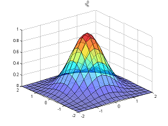
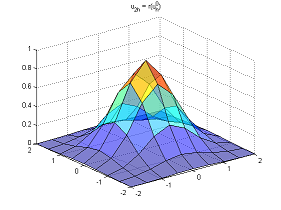
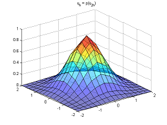
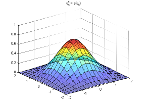

# Multigrid method for elliptic equations

This study project includes the entire algorithm of the [Multigrid method](https://en.wikipedia.org/wiki/Multigrid_method), which was applied to simple math problem as an example.  
The problem contains an elliptic differential equation, Dirichlet boundary condition on a square domain; exact solution is known.  
The problem is approximated by the finite volume method.  
The spectral radius of iteration matrix and the error were calculated during the solving to show convergence.  
The package contains as submodules:
 - _Iteration methods: Jacobi, Seidel, SOR_ were used as smoothing methods, but can also be used to directly solve the problem;
 - _Block tridiagonal method_ was used to solve the problem on the coarsest grid;
 - _Smoothing algorithm_ was applied to the intermediate numerical solution.

